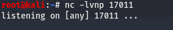

# register's accumulator

# register's accumulator

A place for notes on machines from Hack the Box: [https://www.hackthebox.eu](https://www.hackthebox.eu), and other resources I've found and learned from on my journey. 

&nbsp;

## Read this First:

/1. This site is meant as an educational resource and notes repository for my own journey. You must have permission of the machine or site owner before attempting any of the techniques or exploits described here.

/2. Links and tools change over time. If something on here is broken or does not work as shown, please reach out via discord or e-mail.

/3. Commands in a Linux terminal or Windows cmd prompt will be described and shown like this. 

Set up our nc listener:

    nc -lvnp 17011

These commands are shown so you can copy the whole line and not have to remove a prompt or other extra characters. In most cases, I also post a screenshot of the command and the expected output.

/4. Code examples for you to use will appear separately for ease of copying/pasting and maintaining any required formatting. 

hello.py:

    #!/usr/bin/python3
    print("Hello World!")
            

&nbsp;

## Posts

### 1. HTB Lame : 2020-07-07 
[https://rax-register.github.io/2020/07/07/htb-lame.html](https://rax-register.github.io/2020/07/07/htb-lame.html)
